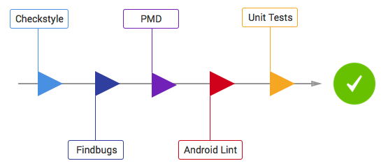

# Lunch Pals [](https://travis-ci.org/reustonium/Lunch-Pals)

## Architecture

This project follows ribot's Android architecture guidelines that are based on [MVP (Model View Presenter)](https://en.wikipedia.org/wiki/Model%E2%80%93view%E2%80%93presenter). Read more about them [here](https://github.com/ribot/android-guidelines/blob/master/architecture_guidelines/android_architecture.md). 


## Code Quality

This project integrates a combination of unit tests, functional test and code analysis tools. 

### Tests

To run **unit** tests on your machine:

``` 
./gradlew test
``` 

To run **functional** tests on connected devices:

``` 
./gradlew connectedAndroidTest
``` 

Note: For Android Studio to use syntax highlighting for Automated tests and Unit tests you **must** switch the Build Variant to the desired mode.

### Code Analysis tools 

The following code analysis tools are set up on this project:

* [PMD](https://pmd.github.io/): It finds common programming flaws like unused variables, empty catch blocks, unnecessary object creation, and so forth. See [this project's PMD ruleset](config/quality/pmd/pmd-ruleset.xml).

``` 
./gradlew pmd
```

* [Findbugs](http://findbugs.sourceforge.net/): This tool uses static analysis to find bugs in Java code. Unlike PMD, it uses compiled Java bytecode instead of source code.

```
./gradlew findbugs
```

* [Checkstyle](http://checkstyle.sourceforge.net/): It ensures that the code style follows [our Android code guidelines](https://github.com/ribot/android-guidelines/blob/master/project_and_code_guidelines.md#2-code-guidelines). See our [checkstyle config file](config/quality/checkstyle/checkstyle-config.xml).

```
./gradlew checkstyle
```

### The check task

To ensure that your code is valid and stable use check: 

```
./gradlew check
```

This will run all the code analysis tools and unit tests in the following order:



> Credit to Ribot's awesome [Android-Boilerplate](https://github.com/ribot/android-boilerplate)
